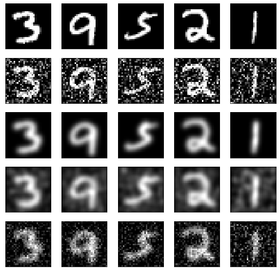
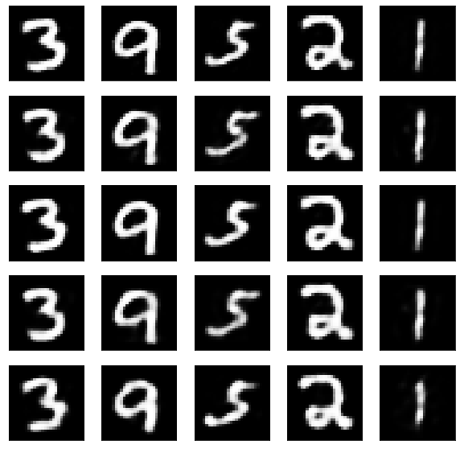
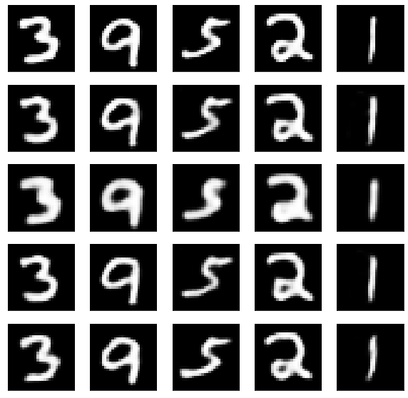

# Автоэнкодеры
В данной работе демонстрируется применение автоэнкодеров для повышения качества изображений и шумоподавления.
В качестве выборки был взят набор данных MNIST. Были искусствено применены зашумление, смазывание по отдельности и в комбинации.
Итоговые выборки

Применялись полносвязный и свёрточный автоэнкодеры.
Результаты работы полносвязной нейронной сети

Результаты работы свёрточной нейронной сети
